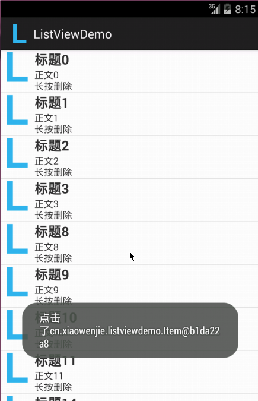

# AndroidAnotationsListViewDemo

使用 `androidanotations` 的 listview demo。是前2年带Android项目时候写的一个很简单的使用 `AndroidAnnotations` 的范例代码。实现了一个很常规的功能，非常少的代码量，低耦合的代码，个人觉得不错。

`AndroidAnnotations` 是基于 `APT` 技术的一个开源框架，确实能减少很多代码量，也不知道现在这种模式是否过时了呢？

当时实在受不了Android开发人员写的代码，无与伦比的耦合性，特意给他们做的一个范例，很简单，主要是演示 `AndroidAnnotations` 的使用和工作机制的。`AndroidAnnotations` 具体的配置大家自己上网找吧。不复杂。

项目中观察发现，没有做过j2ee开发的Android开发人员，【普遍】技术功底很差，编码习惯也是，一些很简单的代码，能写出耦合性非常强的代码，关键是他们还没有感觉到问题在哪里，而且很多人都是这样写的。我猜想他们是看同样的教程入门的，所以才会犯这些同样的错误。可见大家写教程的代码规范的重要性，一不小心就误人子弟了！

有兴趣的可以看看代码，使用了`AndroidAnnotations` 简化了很多无关重要的代码。不要看功能，最重要的是，这几个类里面怎么样写到耦合最小。写过Android的同学一对比就知道了。

`APT` 的技术也很简单，项目组之前也写过用于生成java代码，但感觉apt快要过时的样子，用得越来越少了。

